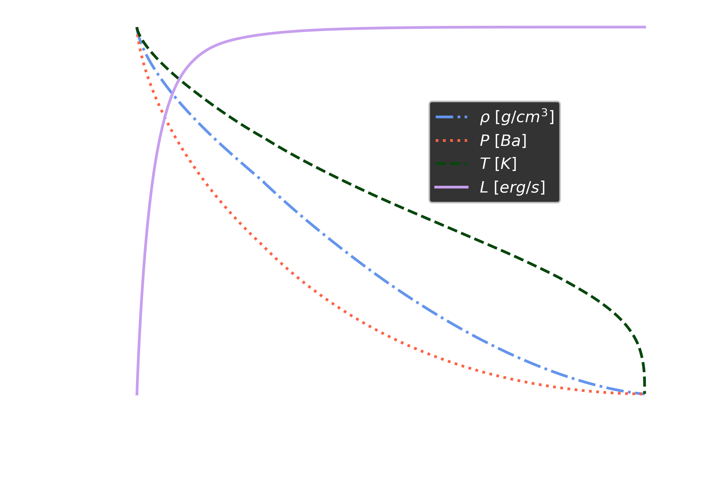
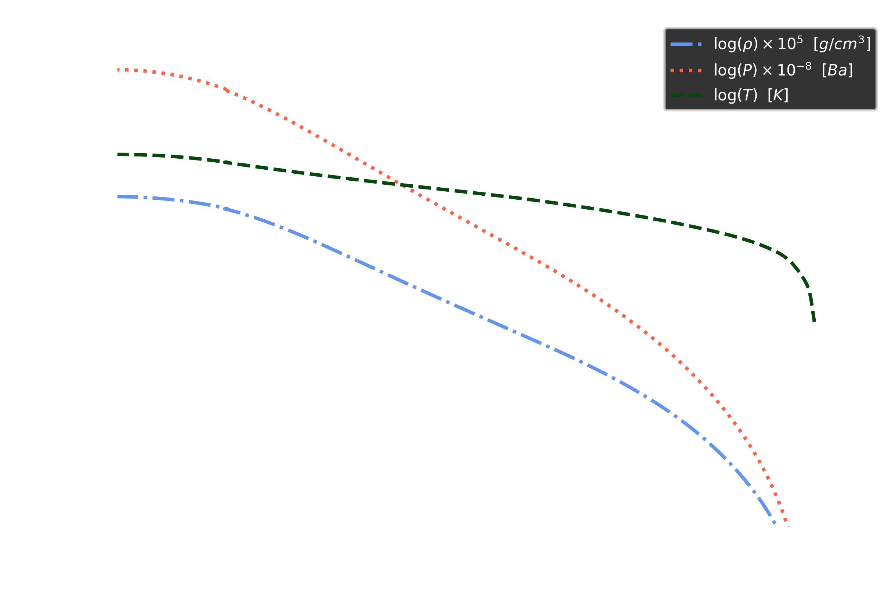
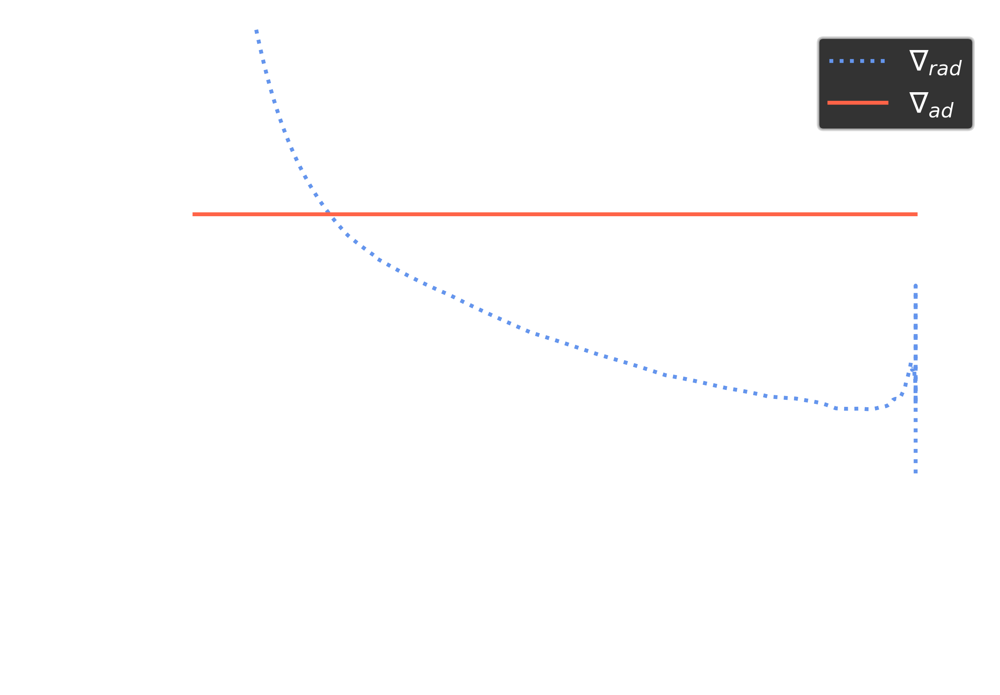
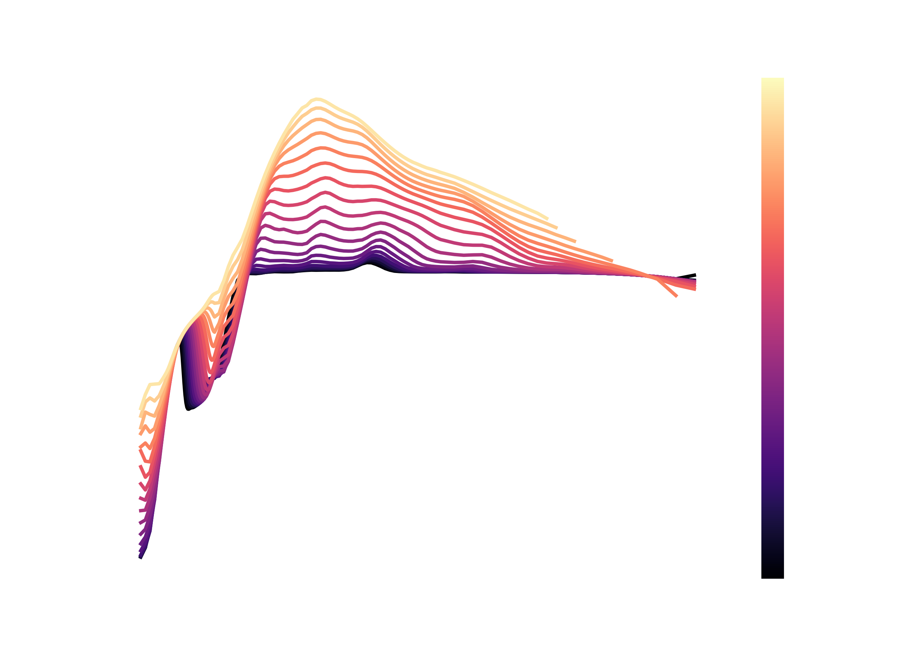
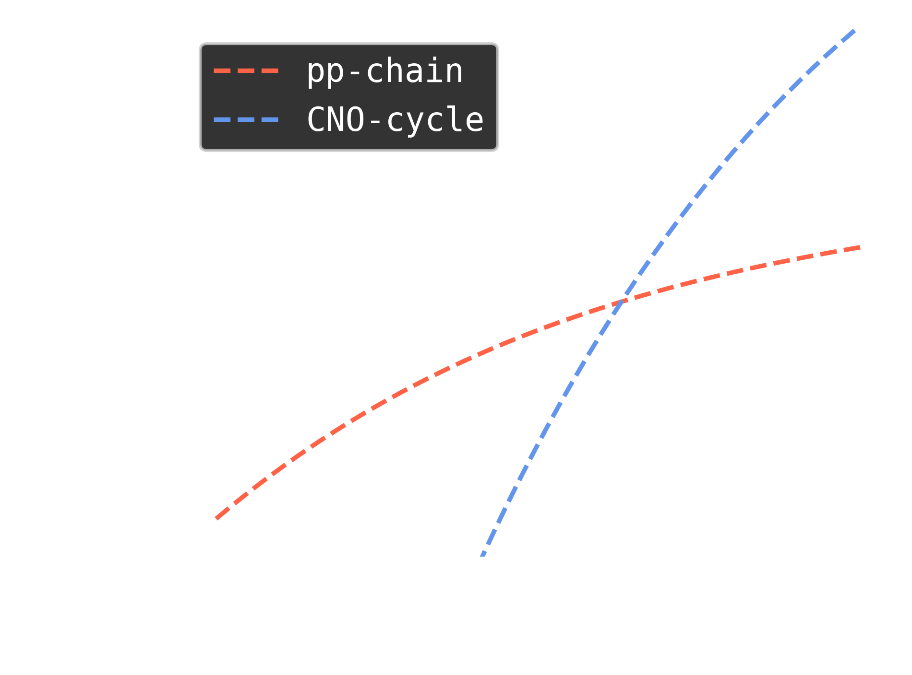

# StellaLuna
A Roughshod ZAMS Structure Code

Written by William Balmer, April 2023, for AS.171.611.01 "Stellar Structure and Evolution" at the Johns Hopkins University.

| :warning: WARNING StellaLuna is not yet appropriate for stars with convective envelopes.        |
|:---------------------------|

## A converged model example

For a $M=3.0\~M_\odot$ star, gives a radius of $R_\star=2.17\~R_\odot$ (within 6.7\% of MESA), a central temperature of $\log{T_c [K]}=7.37$ (within 0.15\% of MESA), a central pressure of $\log{P_c [dyne/cm^2]} = 17.03$ (within 0.45\% of MESA), and a total luminosity of $L_{\star}=81\~L_\odot$ (within 4.16\% of MESA).

The run of a StellaLuna model for a $M=3.0~M_\odot$ star over the lagrangian mass coordinate.

The run of a StellaLuna model for a $M=3.0~M_\odot$ star over radius in the style of Figure 9.1 from HKT 2nd ed.

A comparison between $\nabla_{rad}$ and $\nabla_{ad}$ over the lagrangian mass coordinate for a $M=3.0~M_\odot$ star.

## Extras

:cloud: A note on opacities. StellaLuna implements mean opacities from GN93 + F05 (for low temperatures) for Z=0.02.

:star2: StellaLuna implements energy generation from a combination of the pp-chain and CNO cycle using using the polynomial fits from Angulo+99 recorded in KWW 2nd ed. Ch 18.5.

