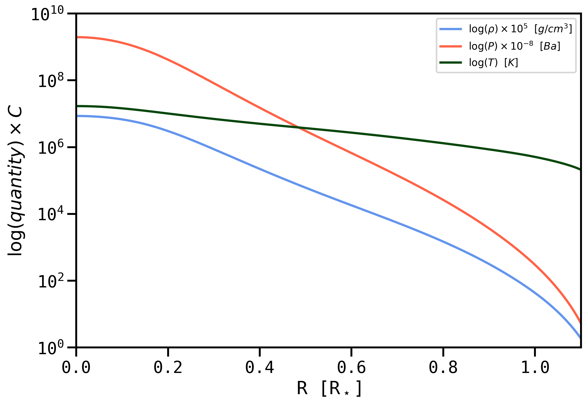

# StellaLuna
A Roughshod ZAMS Structure Code

Written by William Balmer, April 2023, for AS.171.611.01 "Stellar Structure and Evolution" at the Johns Hopkins University. StellaLuna is not yet appropriate for stars with convective envelopes.

For a $M=1.67~M_\odot$ star, stella gives

The run of a StellaLuna model for a $M=1.33~M_\odot$ star over the lagrangian mass coordinate.

The run of a StellaLuna model for a $M=1.33~M_\odot$ star over radius in the style of Figure 9.1 from HKT 2nd ed.

A comparison between $\nabla_{rad}$ and $\nabla_{ad}$ over the lagrangian mass coordinate for a $M=1.33~M_\odot$ star.

