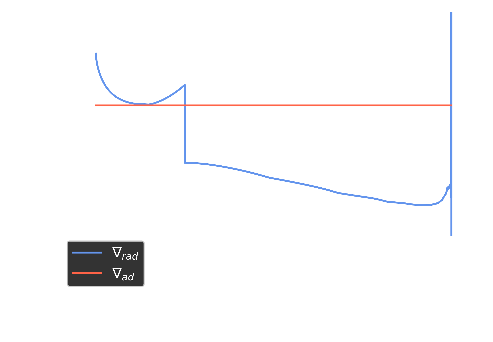

# StellaLuna
A Roughshod ZAMS Structure Code

Written by William Balmer, April 2023, for AS.171.611.01 "Stellar Structure and Evolution" at the Johns Hopkins University.

| :warning: WARNING StellaLuna is not yet appropriate for stars with convective envelopes.        |
|:---------------------------|

## A converged model example

For a $M=1.33\~M_\odot$ star, StellaLuna takes 18 evaluations to achieve sum-squared differences between shootf results <1e-6. StellaLuna gives a radius of $R_\star=1.45\~R_\odot$ (within 5.8\% of MESA), a central temperature of $T_c = 1.68\times10^7 K$ (within 6.1\% of MESA), a central pressure of $P_c = 1.89\times10^{17}\~Pa$, and a total luminosity of $L_{\star}=2.71\~L_\odot$ (within 1.1\% of MESA). 

The run of a StellaLuna model for a $M=1.33~M_\odot$ star over the lagrangian mass coordinate.

The run of a StellaLuna model for a $M=1.33~M_\odot$ star over radius in the style of Figure 9.1 from HKT 2nd ed.

A comparison between $\nabla_{rad}$ and $\nabla_{ad}$ over the lagrangian mass coordinate for a $M=1.33~M_\odot$ star.

## Extras

:cloud: A note on opacities. StellaLuna implements mean opacities from GN93 + F05 (for low temperatures) for Z=0.02.

:star2: StellaLuna implements energy generation from a combination of the pp-chain and CNO cycle using using the polynomial fits from Angulo+99 recorded in KWW 2nd ed. Ch 18.5.

